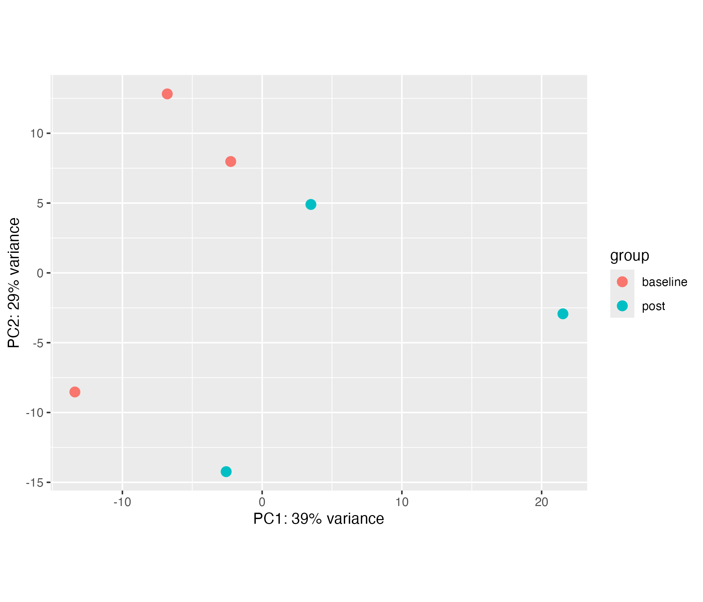
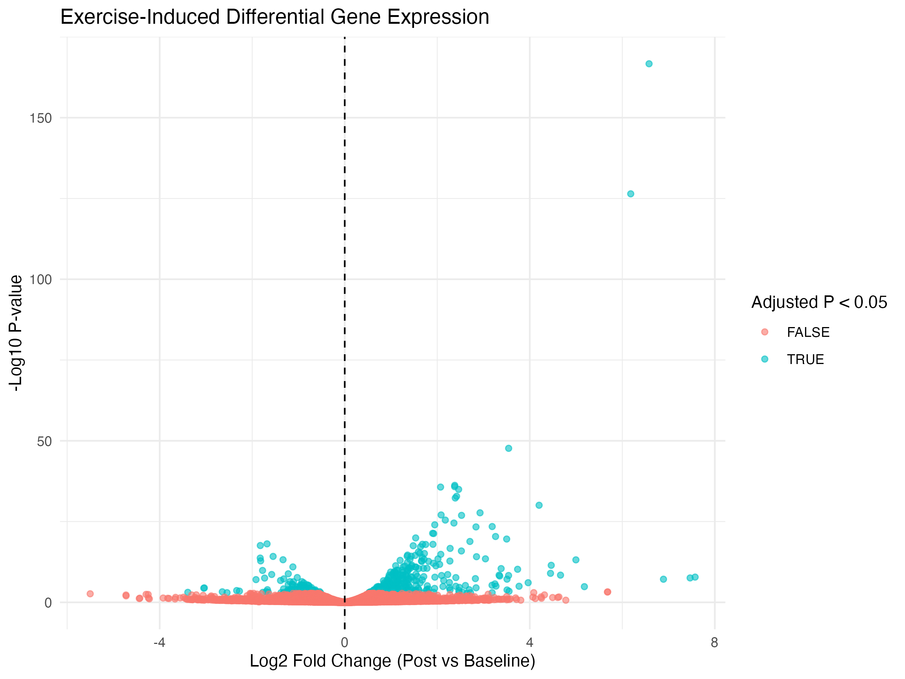

# Exercise-Induced Gene Expression Analysis

RNA-seq analysis of exercise-induced gene expression changes in human skeletal muscle using publicly available sequencing data from **GEO accession GSE120862**.

## Project Overview

This project investigates how aerobic exercise influences gene expression in human skeletal muscle. The goal was to build an end-to-end RNA-seq workflow and identify genes whose expression changes following exercise.

The analysis begins with raw sequencing reads and progresses through quality control, genome alignment, gene-level quantification, differential expression analysis, and biological interpretation.

## Research Question

**How does exercise influence gene expression in human skeletal muscle, and which genes and biological processes are associated with the response to exercise?**

## Dataset

* **Source:** NCBI Gene Expression Omnibus (GEO)
* **Accession:** GSE120862
* **Organism:** *Homo sapiens*
* **Tissue:** Skeletal muscle
* **Sequencing:** RNA-seq
* **Comparison:** Baseline vs. post-exercise samples

A subset of samples from the dataset was used for the analysis.

## Bioinformatics Pipeline

The project followed this general workflow:

**Raw RNA-seq reads → FastQC → HISAT2 → featureCounts → DESeq2 → PCA / Volcano Plot → Gene Ontology**

### 1. Quality Control — FastQC

Raw sequencing reads were evaluated with **FastQC** to assess sequencing quality before downstream analysis.

### 2. Read Alignment — HISAT2

RNA-seq reads were aligned to the human **GRCh38 reference genome** using **HISAT2**.

HISAT2 performs efficient spliced alignment, allowing RNA-seq reads spanning exon-exon junctions to be mapped to the reference genome.

### 3. Gene Quantification — featureCounts

Aligned reads were assigned to genes using **featureCounts** and a GENCODE gene annotation file.

The resulting gene-count matrix contained read counts for each gene across the analyzed samples and served as the input for differential expression analysis.

### 4. Differential Expression — DESeq2

Differential gene expression analysis was performed in **R using DESeq2**.

DESeq2 models RNA-seq count data using a negative binomial model and was used to compare gene expression between baseline and post-exercise samples.

The analysis included:

* Count normalization
* Differential expression testing
* Log2 fold-change estimation
* Multiple-testing correction
* Identification of differentially expressed genes

### 5. Data Visualization

Gene-expression patterns and differential-expression results were explored using:

* **Principal Component Analysis (PCA)** to examine overall variation among samples
* **Volcano plots** to visualize statistical significance and magnitude of gene-expression changes
* Ranked differential-expression results to investigate genes of biological interest

### 6. Functional Interpretation

Genes identified through differential expression analysis were investigated using **Gene Ontology (GO)** to explore their biological functions and associated processes.

The analysis also examined **PPARGC1A**, a gene associated with metabolic and mitochondrial responses to exercise.

## Statistical Methods

Several computational and statistical approaches were incorporated into the workflow:

* **HISAT2 sequence alignment** for mapping RNA-seq reads to the reference genome
* **featureCounts read assignment** for gene-level quantification
* **Negative binomial modeling** with DESeq2
* **Benjamini-Hochberg multiple-testing correction**
* **Principal Component Analysis (PCA)** for dimensionality reduction and visualization

## Tools & Technologies

* **R**
* **DESeq2**
* **Linux / Unix**
* **High-Performance Computing (HPC)**
* **FastQC**
* **HISAT2**
* **featureCounts**
* **NCBI SRA Toolkit**
* **Gene Ontology**
* **GRCh38 human reference genome**
* **GENCODE gene annotation**

## Repository Structure

```text
exercise-gene-expression-rnaseq/
│
├── README.md
├── LICENSE
├── .gitignore
│
├── scripts/
│   ├── 01_download_qc.sh
│   ├── 02_hisat2_alignment.sh
│   ├── 03_featurecounts.sh
│   └── 04_deseq2_analysis.R
│
├── data/
│   └── sample_metadata.csv
│
└── results/
    ├── pca_plot.png
    ├── volcano_plot.png
    └── differential_expression_results.csv
```

Large sequencing and alignment files such as FASTQ, SAM, and BAM files are not included in the repository.

## Results

### Principal Component Analysis

PCA was used to visualize overall gene-expression variation among baseline and post-exercise samples.



### Differential Gene Expression

DESeq2 was used to identify genes showing differences in expression between baseline and post-exercise conditions.



### Biological Interpretation

Differential expression analysis identified 480 genes with an adjusted p-value below 0.05, including 349 upregulated and 131 downregulated genes in post-exercise samples relative to baseline. The strongest observed expression changes included genes with log2 fold changes greater than +7 and below −3.

### PPARGC1A

PPARGC1A was examined because of its established role in mitochondrial biogenesis and metabolic adaptation to endurance exercise.

PPARGC1A showed a small positive log2 fold change of 0.143, but the result was not statistically significant (padj = 0.926). This highlights the distinction between a biologically relevant candidate gene and a statistically supported differential-expression result.

## Reproducibility

The computational portion of this project was performed in a **Linux high-performance computing environment**.

Raw sequencing data are publicly available through **GEO accession GSE120862**. Large raw and intermediate sequencing files are excluded from this repository due to file size.

Scripts used for quality control, alignment, gene quantification, and differential-expression analysis are provided to document the workflow.

## Project Purpose

This project was completed as part of undergraduate bioinformatics coursework and demonstrates experience with:

* End-to-end RNA-seq analysis
* High-performance computing
* Linux command-line workflows
* Genomic data processing
* Statistical analysis of gene-expression data
* Biological interpretation of computational results
