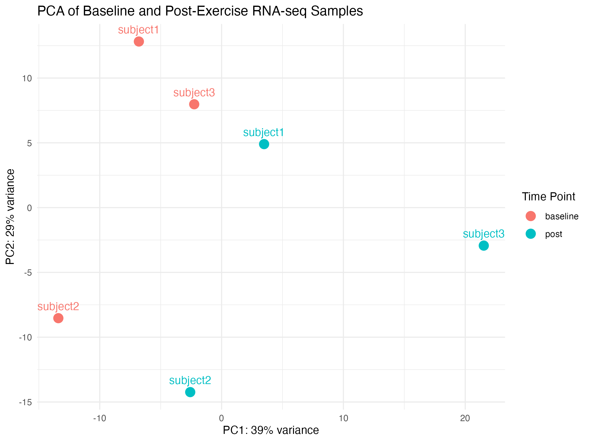

# Exercise-Induced Gene Expression: RNA-seq Analysis

End-to-end RNA-seq analysis of exercise-induced gene expression changes in human skeletal muscle using publicly available data from **GEO accession GSE120862**.

This project demonstrates a complete bioinformatics workflow from raw sequencing reads through alignment, gene quantification, differential expression analysis, gene annotation, and visualization.

## Project Overview

The goal of this project was to investigate transcriptional changes in human skeletal muscle following aerobic exercise.

A subset of six RNA-seq samples representing three matched subjects at baseline and post-exercise was processed on a high-performance computing system and analyzed using a paired differential expression design.

The complete workflow combines Linux/HPC processing with statistical analysis in R.

## Workflow

**NCBI SRA → FASTQ → FastQC → HISAT2 → SAM/BAM → featureCounts → DESeq2 → Gene Annotation → PCA & Volcano Plot**

### 1. Raw Read Processing

Raw RNA-seq reads were downloaded from the NCBI Sequence Read Archive using SRA Toolkit.

### 2. Quality Control

FastQC was used to assess sequencing quality, including base quality, sequence duplication, GC-content distribution, and potential adapter contamination.

### 3. Alignment

Single-end sequencing reads were aligned to the human **GRCh38** reference genome using HISAT2.

### 4. Alignment Processing

SAMtools was used to:

- Convert SAM files to BAM format
- Sort BAM files
- Index sorted BAM files

### 5. Gene Quantification

Gene-level read counts were generated with featureCounts using the **GENCODE v44** human gene annotation.

The resulting count matrix was used as input for downstream statistical analysis.

### 6. Differential Expression Analysis

Differential expression analysis was performed in R using **DESeq2**.

The paired model:

```r
~ subject + time_point
```

accounts for subject-level variation while testing for expression changes between baseline and post-exercise samples.

Low-count genes were removed prior to analysis.

### 7. Gene Annotation and Visualization

Ensembl gene identifiers were mapped to human gene symbols and gene names to support biological interpretation.

Results were visualized using:

- Principal Component Analysis (PCA)
- Volcano plots
- Ranked upregulated and downregulated gene tables

## Results

After low-count filtering:

- **22,770 genes** were analyzed
- **480 genes** were significantly differentially expressed (`adjusted p-value < 0.05`)
- **349 genes** were significantly upregulated
- **131 genes** were significantly downregulated

### PCA



Principal component analysis of variance-stabilized expression data was used to examine global expression patterns across baseline and post-exercise samples.

### Volcano Plot


The volcano plot summarizes genome-wide expression changes following exercise and highlights genes meeting the adjusted p-value significance threshold.

## Repository Structure

```text
.
├── analysis/
│   └── RNASeq_Stats.Rmd
│
├── data/
│   └── sample_data.csv
│
├── docs/
│   └── RNASeq_Stats.html
│
├── pipeline/
│   ├── 01_download_reads.sh
│   ├── 02_fastqc.sh
│   ├── 03_align_hisat2.sh
│   ├── 04_process_bam.sh
│   ├── 05_featurecounts.sh
│   └── README.md
│
├── results/
│   ├── differential_expression_results.csv
│   ├── significant_genes.csv
│   ├── top_upregulated_genes.csv
│   ├── top_downregulated_genes.csv
│   ├── pca_plot.png
│   ├── volcano_plot.png
│   └── README.md
│
├── .gitignore
├── LICENSE
└── README.md
```

## Tools and Technologies

### Bioinformatics

- SRA Toolkit
- FastQC
- HISAT2
- SAMtools
- featureCounts
- DESeq2
- AnnotationDbi
- org.Hs.eg.db

### Programming and Computing

- R
- Bash
- Linux
- High-Performance Computing (HPC)
- ggplot2

## Dataset

**GEO accession:** GSE120862

The analysis uses human skeletal muscle RNA-seq samples collected at baseline and following exercise.

A six-sample subset consisting of three matched baseline/post-exercise pairs was used to make the raw-read processing workflow computationally manageable.

## Computational Environment

Raw sequencing data were processed on the **University of Arizona Ocelote HPC system**.

The original HPC workflow used an interactive allocation with 12 tasks and approximately 72 GB of total requested memory.

The shell scripts in `pipeline/` use relative paths so the workflow can be adapted to other Linux/HPC environments with the appropriate software and reference files installed.

Large FASTQ, BAM, genome index, and reference files are intentionally excluded from the repository.

## Reproducibility

The project is divided into two major stages:

1. `pipeline/` contains the Linux/HPC workflow that converts raw sequencing reads into a gene-level count matrix.
2. `analysis/RNASeq_Stats.Rmd` contains the R workflow used for differential expression analysis, annotation, statistical interpretation, and visualization.

The rendered analysis is available in `docs/RNASeq_Stats.html`, while exported tables and figures are available in `results/`.

## Author

**Vincent Casilio**  
B.S. Bioinformatics  
University of Arizona
